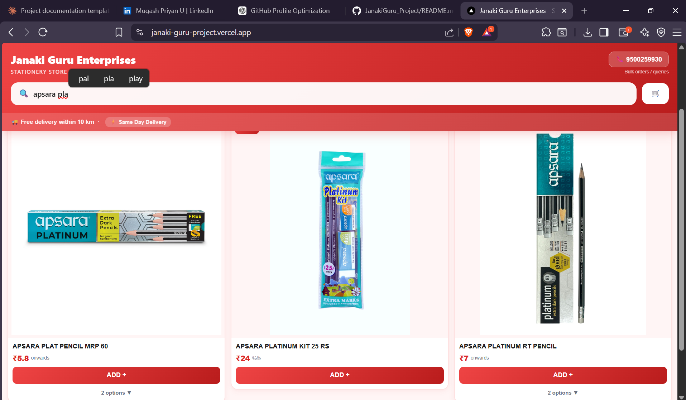
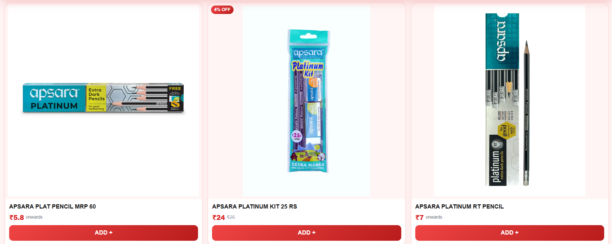
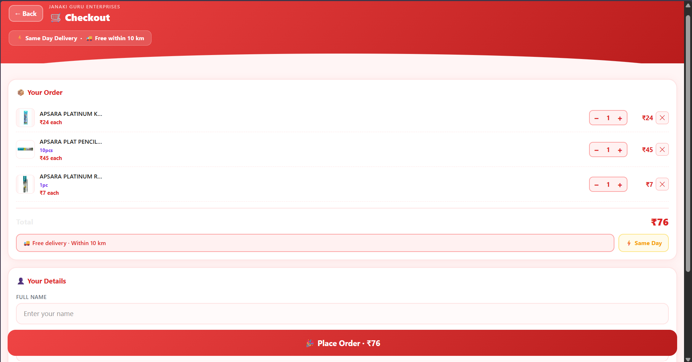
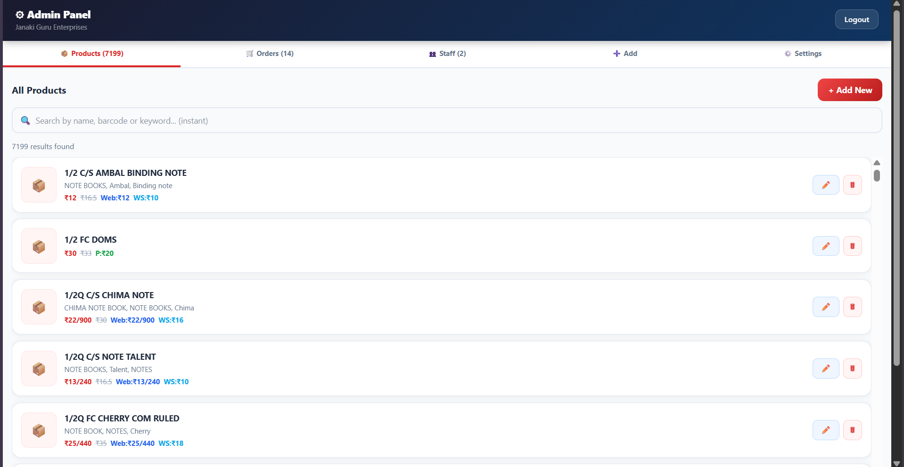
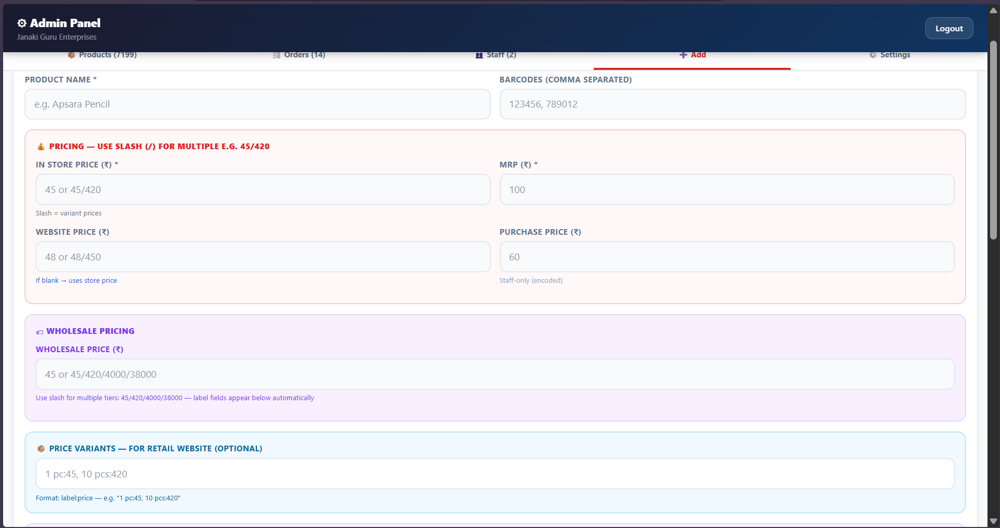
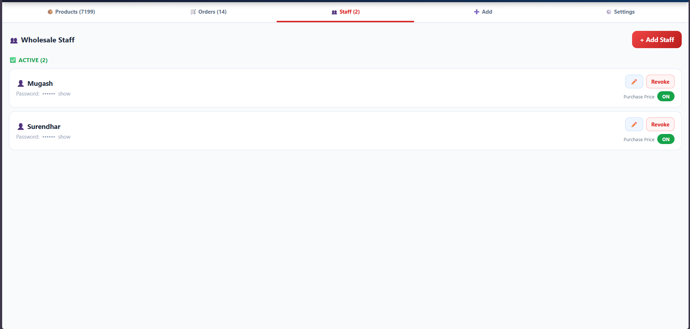

<h1 align="center">🛒 Janaki Guru Retail Ecosystem</h1>

<h3 align="center">
Real-world retail & wholesale management ecosystem used by Janaki Guru Enterprises
</h3>

<p align="center">


</p>

---

# 🌍 About The Project

**Janaki Guru Retail Ecosystem** is a production-oriented software system developed for **Janaki Guru Enterprises (Thoothukudi)** to support retail operations, inventory handling, pricing workflows, and business management.

The platform combines:

🛍 Customer retail website

📊 Admin dashboard

📦 Product & inventory management

👤 Staff management

💰 Dynamic pricing system

📷 Media upload workflows

The system currently supports **7000+ imported products** and is actively used in business workflows.

---

# 🚀 Live Deployment

Customer Website:

https://janaki-guru-project.vercel.app/

Admin Panel:

https://janaki-guru-project.vercel.app/jg-admin-2025

---

# ✨ Key Features

### 🛍 Customer Platform

✔ Product catalog

✔ Variant selection (Zepto-style dropdown)

✔ Swipe image gestures

✔ Cart management

✔ Bulk order contact system

✔ Same-day delivery indicators

✔ Checkout workflows


---

### 📊 Admin Dashboard

✔ Product CRUD

✔ Staff management

✔ Pricing controls

✔ Media uploads

✔ Category handling

✔ Barcode storage

✔ Authentication system

---

### 📦 Inventory Management

Supports:

```text
7000+ products
```

Imported from legacy billing databases.

---

# 🧠 Advanced Features

### 🔐 Staff Authentication

Secure access with restricted dashboards.

---

### 📸 Media Upload System

Supports:

- imgbb image uploads
- Cloudinary video uploads
- Preview & delete workflows

---

### 📊 Pricing System

Handles:

Retail pricing

Wholesale pricing

Purchase pricing

Custom pricing logic

---

### 📥 Legacy Data Import

Imported thousands of existing business products from Excel datasets.

---

# 🛠 Tech Stack

Frontend:

React • TypeScript

Backend:

Supabase • PostgreSQL

Media:

imgbb • Cloudinary

Hosting:

Vercel

---

# 🖼 Screenshots

## Homepage



---

## Product Page



---

## Cart



---

## Admin Dashboard



---

## Product Upload



---

## Staff Management



---


---

# 📈 Business Impact

This system is:

✅ Deployed

✅ Used in real workflows

✅ Supports product management at scale

✅ Built for actual business requirements

---

# 🔒 Access Notice

Some administrative features require business credentials and are not publicly exposed.

Screenshots are provided instead of demo accounts.

---

# 🔮 Future Improvements

- Analytics dashboard
- Sales insights
- Automated inventory alerts
- Supplier management
- Invoice generation
- Customer recommendation engine

---

# 👨‍💻 Developer

**Mugash Priyan U**

M.Tech (Integrated) CSE - Data Science

SRM Institute of Science & Technology

GitHub:

https://github.com/umugash

---

⭐ If you found this project interesting, consider starring the repository.
